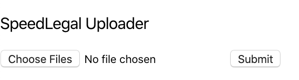

# Full-stack question

## How to run locally ?

1. Build the container 

   ```docker-compose build ```

   This will take a while on Mac.

2. Run the container
   ```docker-compose up```

# Question

1. We have an issue when we run the ```docker-compose up```, can you make it work again like in the image below?


2. Can you add another download function for the app?


